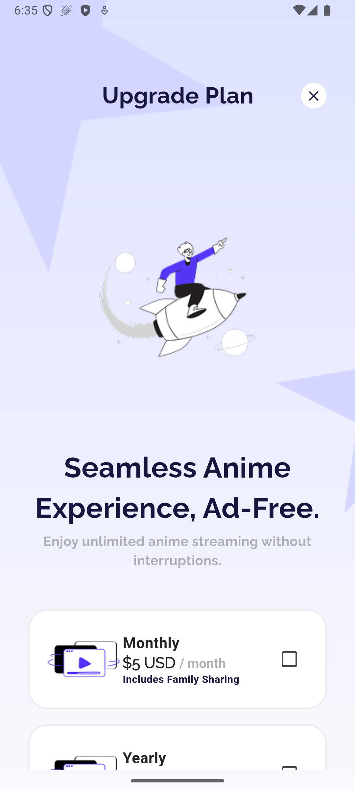

# Anime Streaming App - Clean Architecture UI Implementation

A Flutter application that demonstrates Clean Architecture principles through a pixel-perfect implementation of an anime streaming app UI design.

## Project Overview

This project focuses on implementing the exact UI design provided in Figma while following Clean Architecture principles. The app showcases a modern anime streaming platform with multiple screens and interactive components.

## Features

### Core Functionality

- **Home Screen**: Featured anime posters with categories and top characters
- **Details Screen**: Detailed anime information with ratings and action buttons
- **Upgrade Plan Screen**: Subscription plans with interactive selection
- **Custom Bottom Navigation**: Animated navigation with selected states
- **Responsive Design**: Fully responsive across different screen sizes

### UI Components

- **Category Selection**: Horizontal scrollable category chips
- **Poster Cards**: Interactive anime poster cards with ratings
- **Character Profiles**: Circular character avatars with information
- **Custom Buttons**: Reusable button components with icons and animations
- **Plan Cards**: Interactive subscription plan selection cards

## Screenshots

|                  Upgrade Screen                   |                    Home Screen                    |                  Details Screen                   |
| :-----------------------------------------------: | :-----------------------------------------------: | :-----------------------------------------------: |
|  |        |  |
|   Subscription plans with interactive selection   | Featured anime with categories and top characters |  Detailed anime information with action buttons   |

## Architecture

### Clean Architecture Structure

```
lib/
├── core/
│   ├── helper/
│   │   ├── app_colors.dart
│   │   ├── app_constants.dart
│   │   ├── app_styles.dart
│   │   └── spacing.dart
│   └── theme/
│       └── container_decorations.dart
├── features/
│   ├── data/
│   │   └── (prepared for future data layer)
│   └── presentation/
│       ├── screens/
│       │   ├── details_screen.dart
│       │   ├── home_screen.dart
│       │   └── upgrade_plan_screen.dart
│       └── widgets/
│           ├── catalog_section.dart
│           ├── custom_bottom_navbar.dart
│           ├── custom_button.dart
│           ├── plan_choice_card.dart
│           ├── poster_widget.dart
│           ├── stat_item.dart
│           └── top_characters_widget.dart
└── main.dart
```

### Architecture Principles

- **Separation of Concerns**: Clear distinction between presentation and core logic
- **Reusable Components**: Modular widgets that can be used across screens
- **Theme Management**: Centralized color scheme and styling
- **Responsive Design**: Consistent sizing across different devices

## Design Implementation

### Color Palette

- **Primary Blue**: #5436F8
- **Secondary Blue**: #6758FE
- **Dark Blue**: #18153F
- **Light Background**: #DDE2FF
- **Off White**: #DEE3FF
- **Grey**: #AEADB5

### Typography

- **Primary Font**: Raleway (Google Fonts)
- **Responsive Sizing**: Using ScreenUtil for consistent typography
- **Weight Hierarchy**: Bold, Semi-bold, and Regular weights

### Key Components

- **Custom Navigation**: Animated bottom navigation with selected states
- **Interactive Cards**: Poster cards with tap navigation and rating displays
- **Responsive Grid**: Category selection with horizontal scrolling
- **Action Buttons**: Preview and Watch Now buttons with proper styling

## Technical Implementation

### Dependencies

```yaml
dependencies:
  flutter:
    sdk: flutter
  flutter_screenutil: ^5.9.0
  google_fonts: ^6.1.0
```

### Responsive Design

- **Base Design Size**: 375x812 (iPhone X)
- **Screen Adaptation**: Automatic scaling using ScreenUtil
- **Flexible Layouts**: Responsive components that work on all screen sizes

### Navigation

- **Screen Transitions**: Material page routes between screens
- **Back Navigation**: Proper navigation stack management
- **Interactive Elements**: Tap gestures with visual feedback

## Screens Breakdown

### 1. Upgrade Screen

- Decorative background elements with star graphics
- Rocket boy illustration as main visual element
- Monthly and yearly subscription plan options
- Interactive plan selection with animated cards
- Upgrade call-to-action button leading to Home Screen

### 2. Home Screen

- Header with "Where Anime Comes Alive" title
- Horizontal category selection (All, Popular, Trending, etc.)
- Featured anime posters carousel with ratings
- Top characters section with circular avatars
- Custom bottom navigation with animated selection states

### 3. Details Screen

- Full-screen anime poster background
- Floating demon character overlay positioned between sections
- Category tags (Dark Fantasy, Action, Adventure)
- Statistics row (views, claps, seasons)
- Description text with small logo
- Preview and Watch Now buttons in bottom navigation bar

## Usage

1. **Clone the repository**
2. **Install dependencies**: `flutter pub get`
3. **Run the app**: `flutter run`

## File Organization

### Core Layer

- **app_colors.dart**: Centralized color definitions
- **app_constants.dart**: Asset paths and static data
- **app_styles.dart**: Typography and text styles
- **container_decorations.dart**: Reusable container decorations

### Presentation Layer

- **Screens**: Main application screens with complete UI implementation
- **Widgets**: Reusable UI components used across multiple screens

## Future Enhancements

- **Domain Layer**: Business logic and use cases
- **Data Layer**: API integration and local storage
- **State Management**: Provider or Riverpod implementation
- **Testing**: Unit and widget tests
- **Animations**: Enhanced transitions and micro-interactions

## Design Fidelity

This implementation achieves pixel-perfect accuracy with the provided Figma design:

- **Color Matching**: Exact color implementation using hex codes
- **Typography**: Proper font weights and sizes
- **Spacing**: Consistent padding and margins
- **Component Behavior**: Interactive elements match design specifications
- **Responsive Scaling**: Maintains design integrity across screen sizes

## Development Notes

- **Clean Code**: Well-organized, readable, and maintainable code structure
- **Best Practices**: Following Flutter development best practices
- **Performance**: Optimized widgets and efficient rendering
- **Accessibility**: Semantic labels and proper widget hierarchy

---

_This project demonstrates the implementation of a complete UI design using Clean Architecture principles in Flutter, focusing on pixel-perfect design recreation and maintainable code structure._
